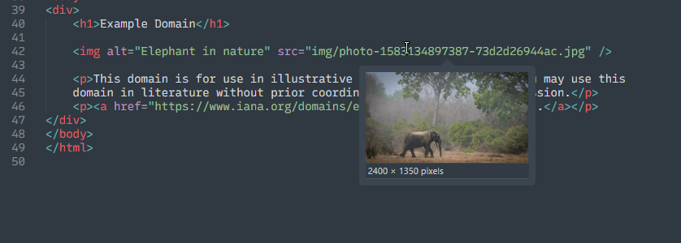
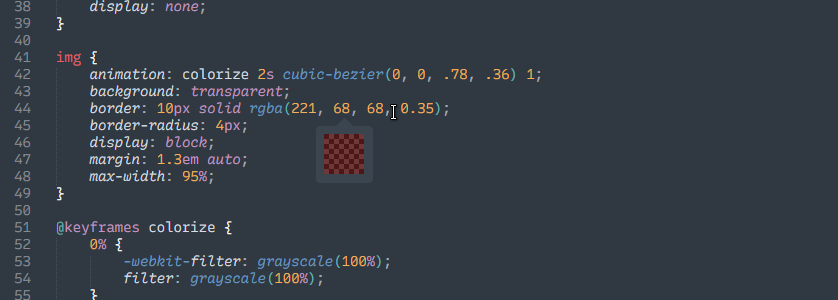

# Quick View for Sublime Text

This package for Sublime Text provides the hover preview popups for images and CSS colors from Adobe Brackets.

The design of the hover popups is intended to reproduce the style of the Quick View feature from Brackets, but it uses adaptive colors based on the color scheme and the plugin logic was written from scratch.

## Installation

The package can be installed via Sublime Text's package manager [Package Control](https://packagecontrol.io/installation).
From the command palette select *Package Control: Install Package* and search for *QuickView*.

## Preview

## Usage and Features

Hover over an image link or CSS color in a supported syntax to show a preview popup.
Image previews are possible for the following file formats:

* PNG
* JPEG
* GIF
* BMP
* SVG
* WebP
* AVIF

The SVG, WebP and AVIF formats require an installed image converter program available in the PATH and must be activated in the package settings.

Image and color previews for the current cursor position or selection can also be invoked from the command palette or by adding a [key binding](https://www.sublimetext.com/docs/key_bindings.html) for the `quick_view` command.
In this case, preview popups are possible for images and colors in plain text as well, and they are attempted to be shown even if image or color previews are disabled in the settings.
